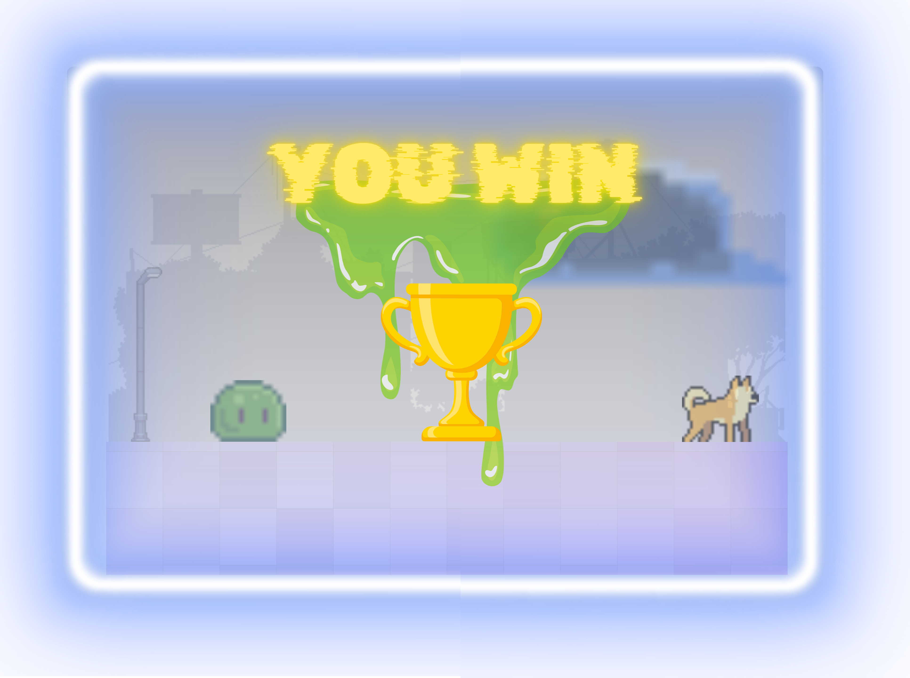

# Polly's Adventure

A 2D side-scrolling jump-and-run game built from scratch with vanilla JavaScript and the HTML5 Canvas API — no frameworks, no build step, no dependencies.

You play as Polly, a dog making her way through a nocturnal city overrun by slimes and a bomb-dropping drone. Collect cards from the card cannon, throw them at your enemies, and survive long enough to take down the end boss.

**▶ [Play it here](https://pollys-adventure.kaloyanivanov.de/)**



## Table of Contents

- [Polly's Adventure](#pollys-adventure)
  - [Table of Contents](#table-of-contents)
  - [Live Demo](#live-demo)
  - [Features](#features)
  - [Gameplay](#gameplay)
  - [Controls](#controls)
    - [Keyboard](#keyboard)
    - [Touch / Mobile](#touch--mobile)
    - [Menu (top-right gear icon)](#menu-top-right-gear-icon)
  - [Getting Started](#getting-started)
    - [Requirements](#requirements)
    - [Running locally](#running-locally)
    - [Deployment](#deployment)
  - [Credits](#credits)

## Live Demo

<https://pollys-adventure.kaloyanivanov.de/>

Best played in landscape on mobile, or fullscreen on desktop.

## Features

- **Object-oriented game engine** — every game entity inherits from a small `DrawableObject` / `MovableObject` class hierarchy
- **Multi-layer parallax scrolling** — five background layers move at independent speeds relative to the camera
- **Sprite animation system** — frame-based animations for walking, jumping, idling, hurting and dying
- **Physics** — gravity, jump arcs, ballistic trajectories for thrown cards and dropped bombs
- **Collision detection** — character vs. enemies, projectiles vs. enemies, projectiles vs. ground, plus area damage from explosions
- **Enemy AI** — patrolling slimes, a drone that tracks the player's position and drops bombs, and an end boss with its own health pool and hurt/death states
- **Full audio layer** — background music, footsteps, jumps, pickups, explosions and enemy sounds, all mutable from the in-game menu
- **Responsive canvas** — the canvas and all HUD buttons are repositioned and rescaled on resize and orientation change
- **Mobile support** — on-canvas touch controls with multi-touch handling, plus a "rotate your device" overlay in portrait mode
- **Fullscreen mode** — with vendor-prefixed fallbacks for older browsers and iOS Safari
- **In-game menu** — sound toggle, play/pause, restart, how-to-play overlay and fullscreen toggle

## Gameplay

1. **Start** on the start screen and press play.
2. **Run right** through the city. Slimes patrol the street and cost you health on contact.
3. **Find the card cannon** — it wakes up when you get close and fires cards at you. Collect them; your card counter fills up in the HUD.
4. **Throw cards** at enemies to destroy them. Cards explode on impact and on the ground.
5. **Watch the sky** — a drone follows you and drops bombs whenever you end up underneath it.
6. **Past x = 3000 the end boss spawns.** It has a large health pool and has to be worn down with cards.
7. **Win** by killing the end boss. **Lose** when your health bar hits zero.

## Controls

### Keyboard

| Key     | Action     |
| ------- | ---------- |
| `A`     | Move left  |
| `D`     | Move right |
| `Space` | Jump       |
| `T`     | Throw card |

### Touch / Mobile

On touch devices the game draws four on-canvas buttons: left, right, jump and throw. Multi-touch is supported, so you can move and throw at the same time. The game asks you to rotate to landscape before playing.

### Menu (top-right gear icon)

| Button       | Action                         |
| ------------ | ------------------------------ |
| Sound        | Mute / unmute all audio        |
| Play / Pause | Pause and resume the game loop |
| Info         | Show the "How to play" overlay |
| Reload       | Restart the level              |
| Fullscreen   | Enter / leave fullscreen       |

## Getting Started

### Requirements

A modern browser and any static file server. There is **no build step and no dependencies** — the game is plain HTML, CSS and JavaScript.

### Running locally

All asset paths in this project are **root-absolute** (`/img/...`, `/models/...`), so the project must be served from the **root of a web server**. Opening `index.html` directly from the file system (`file://`) will not work.

```bash
git clone https://github.com/KaloyanIvan0v/pollys-adventure.git
cd pollys-adventure

# Python 3
python3 -m http.server 8000

# or Node
npx serve -l 8000
```

Then open <http://localhost:8000> in your browser.

> **Note:** the game needs a user interaction before audio can play — browsers block autoplay until the page has been clicked.

### Deployment

The game is live at <https://pollys-adventure.kaloyanivanov.de/>.

Any static host works (GitHub Pages, Netlify, Vercel, classic web hosting), as long as the project sits at the **domain root** — that is what the absolute asset paths require. If you deploy into a subdirectory, they have to be rewritten to relative paths first.

## Credits

- Font: [Open Sans](https://fonts.google.com/specimen/Open+Sans) (SIL Open Font License)
- Music and sound effects from royalty-free sources (see `audio/`)
- Code, game design and integration: Kaloyan Ivanov

Legal pages (Impressum, Datenschutz) are available in `html/`.
